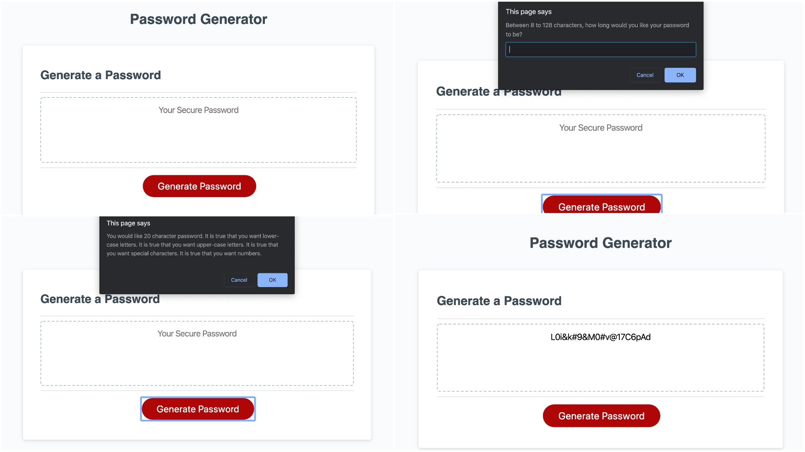

# password-generator

## Summary
The purpose of password-generator is to create a random password (between 8 to 128 characters) based on the users requested criteria. If the user enters doesnt meet the password length or doesnt select at least one criteria, the user will be notified that they have not met the minimum requirements. Once user has confirmed the password criteria then the password will be generated and will be shown on the webpage.

## Depolyed Webpage

 
## Conclusion
With the use of arrays and if/while statements, this webpage will generate a random password based of the user requested criteria. Possible future projects for this webpage is adding form-like layout to help make it more user-friendly.